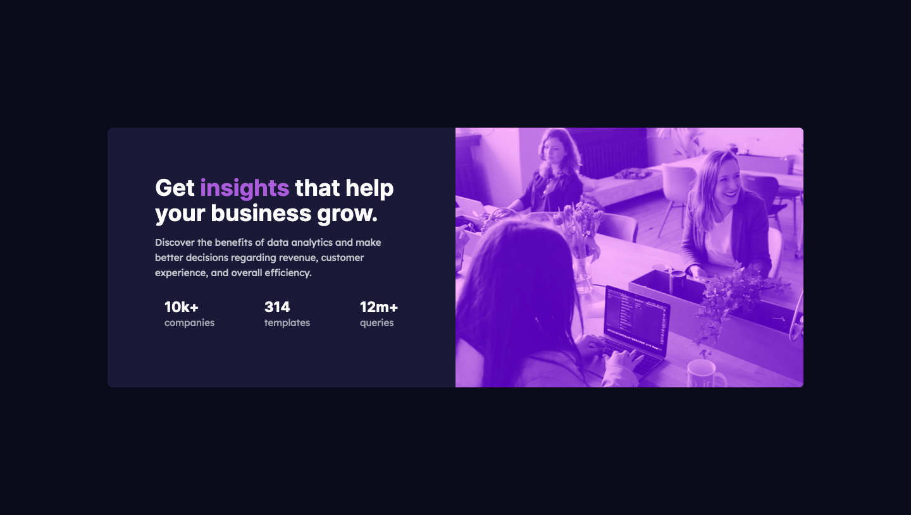

# Frontend Mentor - Stats preview card component solution

This is a solution to the [Stats preview card component challenge on Frontend Mentor](https://www.frontendmentor.io/challenges/stats-preview-card-component-8JqbgoU62). Frontend Mentor challenges help you improve your coding skills by building realistic projects.

## Table of contents

- [Overview](#overview)
  - [The challenge](#the-challenge)
  - [Screenshot](#screenshot)
  - [Links](#links)
- [My process](#my-process)
  - [Built with](#built-with)
  - [What I learned](#what-i-learned)
  - [Continued development](#continued-development)
- [Author](#author)

## Overview

### The challenge

Users should be able to:

- View the optimal layout depending on their device's screen size

### Screenshot



### Links

- Live Site URL: [Live Site URL](https://distracted-sinoussi-1f16ef.netlify.app/)

## My process

### Built with

- Semantic HTML5 markup
- CSS custom properties
- Flexbox
- Mobile-first workflow

### What I learned

I learned how to do CSS image overlays in this project. It was neat to experiment with the different overlay effects.

CSS overlay code is below:

```css
.card__img {
  background-image: url("/images/image-header-mobile.jpg");
  background-color: var(--violet);
  background-blend-mode: overlay;
  background-size: cover;
  background-position: cover;
  height: auto;
  max-width: 100%;
  border-radius: 0.5em 0.5em 0 0;
  flex-basis: 15rem;
}
```

### Continued development

I'm still drilling into my head the whole concept of flexbox. I'm looking forward to working with more flex properties like wrap, flex-basis, flex-grow, and flex-shrink. I'm familiar with these concepts but I need more practice with them.

## Author

- Frontend Mentor - [@afewfirstnames](https://www.frontendmentor.io/profile/afewfirstnames)
